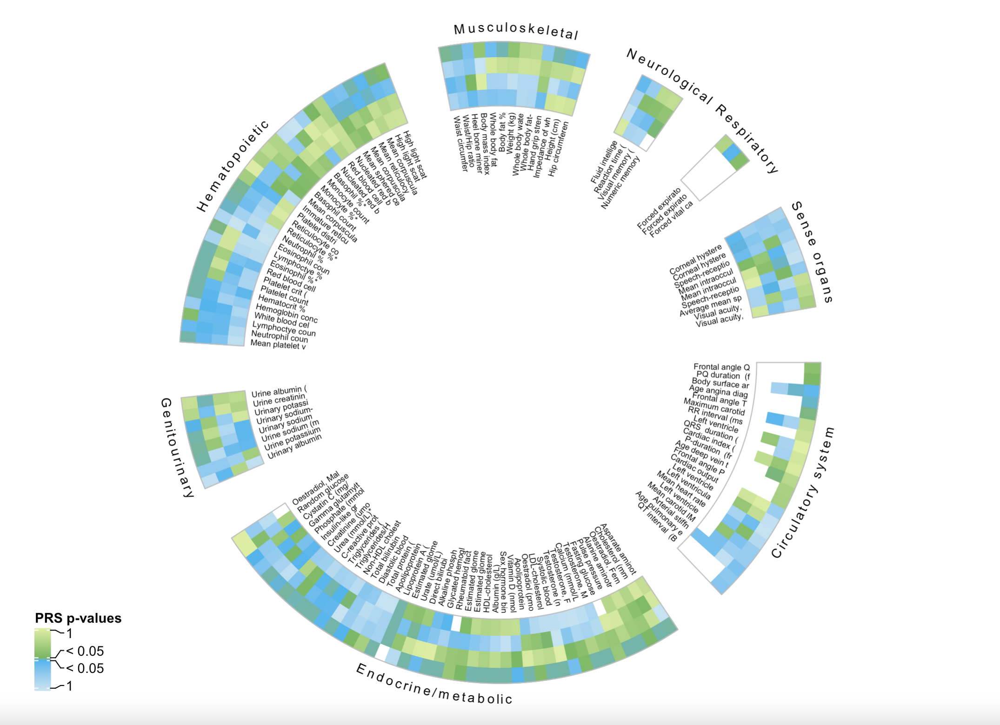
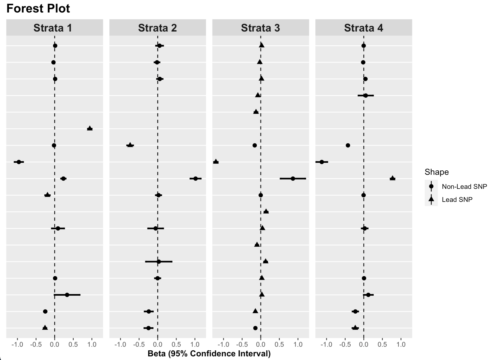
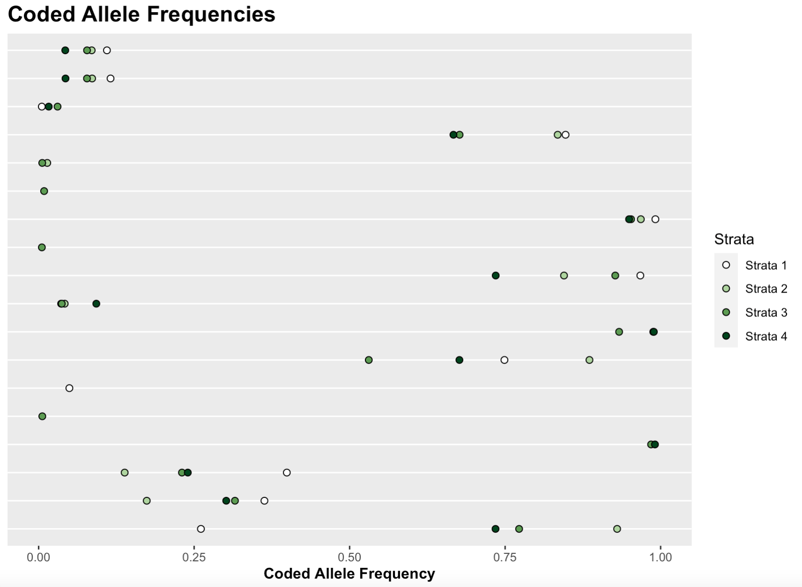

# Lpa_plotting
Plots for high-dimensional, genetic data for  Lp(a)*

*note: this plotting technique was developed for Lp(a) but can be applied to other phenotypes. Titles and labels are de-identified. 

## PheWas Circle Plots
<<<<<<< HEAD
This plot can be used to demonstrate heterogeneity of results across a vast array of phenotypes. Direction of effect as well as strength of effect can be shown through color and shade mapping. Results are split based on 4 strata (each row the the circle). 
=======
This plot can be used to demonstrate heterogeneity of results across a vast array of phenotypes. Direction of effect as well as strength of effect can be shown through color and shade mapping for multiple strata.  
>>>>>>> fae412893d229d508bda077a58e308c5c384fcde

**Relevant Script:** PheWas_circle_plot.R

**Example Plot**:

*Note: The titles are purely to show labels are possible. They are truncated and not meant to be legible for this example.*

## SNP forest plot
These 2 plots can be used to demonstrate SNP effect sizes and confidence intervals as well as heterogeneity in coded allele frequencies by strata. 

**Relevant Script:** Forest_plot.R

**Examples Plots:**

1. Forest Plot

2. Coded Allele Frequencies 

